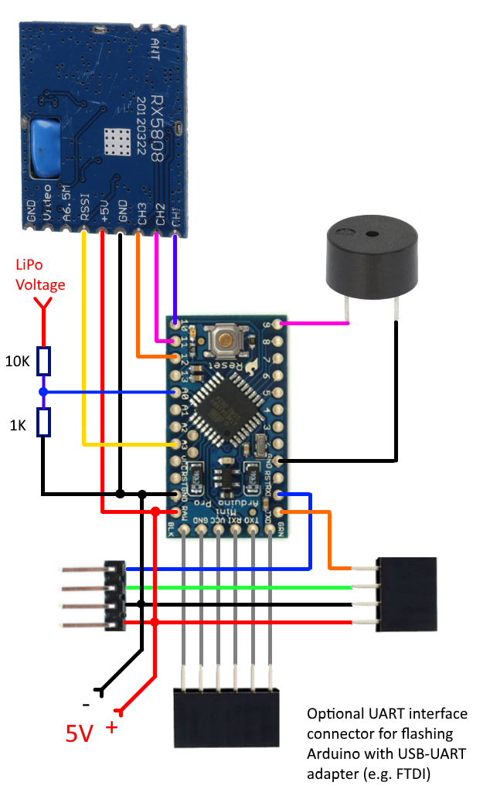

#Chorus RF Laptimer

***Chorus*** [ˈkɔr əs] - *1. (Music) a group of persons singing in unison.*

**NOTE: This project is currently in a "public beta" stage. Changes to schematic and software are very likely. Feel free to contribute and/or share your usage results to improve the project.**

This is a VTX Radio Frequency Lap Timing solution for drone racers - the evolution of a [Solo DIY RF Laptimer project](https://github.com/voroshkov/Solo-DIY-RF-Laptimer).
Several updated Solo Laptimer devices connected together make up a Chorus Laptimer device which is capable of tracking several drones at once.
This is a "lightweight" alternative to IR lap timing systems having the advantage that it does not require any additional equipment on drones except VTX.

##Terminology

**Solo** - device for tracking a single drone. Parts cost about $12. Consists of Arduino Pro mini, RX5808 module, connectors, optional buzzer, optional resistors:

**Chorus** - several (2+) connected Solo devices:

##NEW Features!
- Can be tuned to any RF band/channel
- Monitors several frequencies simultaneously  (corresponding to a number of devices)
- Expandable: make one Solo device and track your solo flight times; make more devices, connect them into a Chorus and compete with teammates
- Automatic detection of a number of Solo devices in a Chorus

##Features (legacy from a Solo-Laptimer project)
- No additional equipment besides 5.8GHz Video Transmitter required on a drone.
- Measure lap times with 1ms resolution (in theory; need to perform live tests).
- Android application for controlling the device via Bluetooth.
- Compatible with [EasyRaceLapTimer](https://github.com/polyvision/EasyRaceLapTimer) software v.0.6 (can act as a VTx sensor).
- 5V * 250 mA power consumption (per device)
- Low cost (around $16 per device, excluding power supply), compared to similar solutions available on market.

##Limitations
- Tracks up to 100 laps.
- Doesn't work with digital VTx equipment (like Connex)
- Settings and measurements data is kept on Arduino side and gets lost when the Laptimer device is powered off.
- Although expandable, definitely has a physical limit on a number of stacked devices (depending on UART throughput of the last device in a chain)
- No software for iOS so far (iOS develpers, please join!).

##How it works
Each Solo device measures a VTx signal strength (RSSI value) and compares it with a threshold set up. If the RSSI value is above the threshold, the corresponding drone is considered passing a finish gate.

##Hardware
###Used parts:
 - RX5808 (with SPI patch) (**N** items)
 - Arduino Pro Mini 5V 16MHz (**N** items)
 - Piezo buzzer (5V, without built-in generator) - optional (**N** items)
 - HC-06 Bluetooth module (**1** item)
 - 5V power supply (for example 2-4S LiPo with 5V BEC) (**1** item)

###RX5808 SPI patch (required)
(copied from [sheaivey/rx5808-pro-diversity](https://github.com/sheaivey/rx5808-pro-diversity) repo)

In order to get the RX5808 to use SPI you will need to open it and remove a single SMD resistor.

For older versions of RX5808 use [these instructions](https://github.com/markohoepken/rx5808_pro_osd/wiki/rs5808-spi-patch).

###Wiring of a Solo device
Parts may be connected directly without using any additional components:

It seems to work fine being connected this way, however adding 100 Ω resistors in line on SPI wires (Arduino pins 10, 11, 12) is a good idea to prevent possible glitches with channel selection:

###Assembly of a Solo device
Correct positioning of RX5808 module against the finish gate area is vital for correct measurements.

I tried using different types of antennas and shields with RX5808 to achieve the best possible accuracy, and finally found that the module itself works as a short-range directional antenna. The non-shielded side of the module is a surface that should face the gate, so consider this fact upon assembling.

###Assembly of a Chorus device

1. Make several Solo devices.
2. Connect them together.
3. Connect a Bluetooth module to the last Solo device in a chain.
4. Use a jumper on the first Solo device to shorten two upper pins.
5. Attach 5V power supply to one of the Solo devices (make sure to supply enough power - each Solo device consumes about 250mA).

##Software
###Arduino
Download the project from Arduino folder, open **chorus-rf-laptimer.ino** file with Arduino IDE and upload to each Solo device.

###Android App
Download the [**ChorusRFLaptimer-release.apk**](https://github.com/voroshkov/Chorus-RF-Laptimer/blob/master/Android/ChorusRFLaptimer/app/ChorusRFLaptimer-release.apk) file from Android/app folder and install on your Android device or use the following QR code to download:

(Make sure to allow installation from unknown sources in your Android device settings).

####App User Guide
Application startup screen:

Use "⋮" menu to connect/disconnect to your Chorus device.

Once connected to Chorus device, the app automatically detects a number of stacked Solo devices and shows corresponding controls.

The app consists of 4 tabs:

- **SETUP** - race preconditions and device settings:
- **FREQ** - VTX channel/band for each Solo device
- **PILOTS** - Pilot name and RSSI threshold for each channel
- **RACE** - start/stop race and race results

Controls on the tabs are mostly self-explanatory. Still some clarifications might be useful:

- **Enable device sounds**: tick to enable device buzzers.
- **Minimal Lap Time**: use +/- to increase/decrease minimal lap time. Set enough time to let a drone leave the "above-threshold RSSI area" after lap time is captured.
- **Skip first lap**: tick if start table is located before the start/finish gate (first lap time will be skipped because it's not a full lap); untick if start table is located right behind the laptimer (first lap time will be tracked only if minimal lap time is passed after the race start).
- **RSSI Threshold**: use +/- to fine-tune RSSI threshold.
- **Set/Clear**: tap to capture/clear currently measured RSSI value as a threshold.
- **Calibrate Timers**: different Arduino devices have different oscillators accuracy and it may slightly deviate from 16MHz. In order to make sure that same timespan is measured equally on different devices, you need to calibrate them before the race.
- **Start Race**: tap to start tracking laps. This same button is used to Stop the race.

When you stop the race, Chorus device immediately clears saved lap times, but they remain visible in the application until new race is started.

##Setup and Usage Guide
 1. Power on the Chorus device and place it on one side of the finish gate.
 2. Start the Android app and connect to the Chorus device.
 3. Setup VTX Band/Channel for each Solo device in Android app (on the "Freq" tab)
 4. Fully prepare racing drones and power them up (VTX must be powered in racing mode).
 5. Go a bit beyond the opposite side of the gate with the powered drone (normally 3-4 meters from the installed Chorus Laptimer).
 6. Capture current RSSI value as a threshold using the Android app (use "Set" button for appropriate channel on "Pilots" tab).
 7. Repeat steps 5,6 for each drone taking part in a race.
 8. Calibrate timers using the corresponding button on a "Race" tab (in case you have more than 1 Solo device).
 6. Start Race in the app.
 7. Fly the track and see the lap times being captured.

Also consider shielding the Chorus device with a piece of metal on one side where drones are approaching from. It might increase the accuracy by partially blocking the VTx signal before a drone is inside a gate.

#Contacts
- YouTube channel: https://www.youtube.com/user/voroshkov
- Facebook: https://www.facebook.com/andrey.voroshkov

Feel free to ask questions, suggest improvements, report your usage results.

Happy flying!
